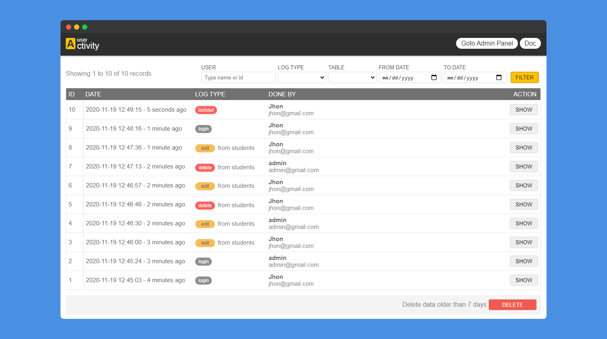

<h1 align="center">Laravel User Activity</h1>

    
     
    
    

Easily monitor your user activity with beautiful responsive & easy user-interface!

## Documentation
Checkout features & full documentation of [Laravel User Activity](https://laravelarticle.com/laravel-user-activity)

## Other Packages
- [Laravel H](https://github.com/haruncpi/laravel-h) - A helper package for Laravel Framework.
- [Laravel ID generator](https://github.com/haruncpi/laravel-id-generator) - A laravel package for custom database ID generation.
- [Laravel Simple Filemanager](https://github.com/haruncpi/laravel-simple-filemanager) - A simple filemanager for Laravel.
- [Laravel Option Framework](https://github.com/haruncpi/laravel-option-framework) - Option framework for Laravel.

### Change Log

v1.0.4
- Completely enable or disable logging by `activated` config value
- Added Base model logging compatibility

v1.0.3
- Minor improvements

v1.0.2
- Create log type added
- User model configuration
- UI ajax loading indicator